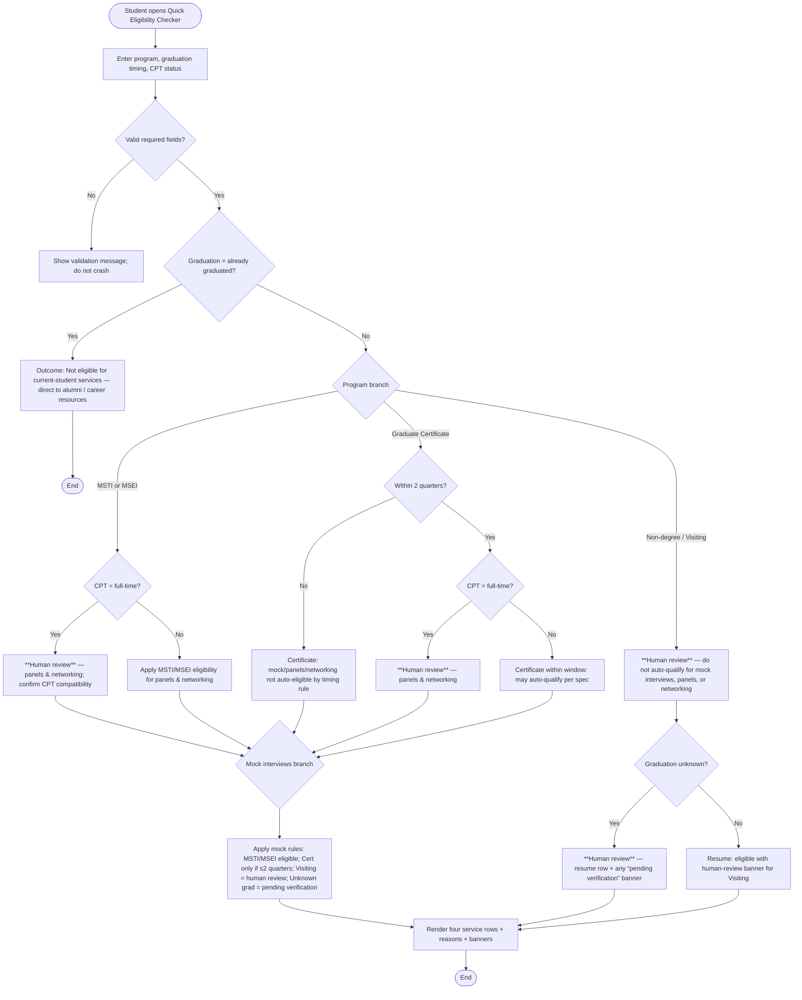

# Eligibility Decision Flowchart

The diagram below uses **Mermaid** (renders in GitHub, VS Code, and many Markdown viewers). It includes **at least three decision branches** (graduation path, program path, CPT path) and marks where **human review** is required instead of a fully automatic yes/no.

## Where human review belongs (edge cases)

| Situation | Why not fully automatic |
|-----------|-------------------------|
| Non-degree / Visiting | Program standing and service access vary case-by-case. |
| Unknown graduation | Cannot verify student timeline or certificate window. |
| Full-time CPT for panels / networking | Work authorization and event participation may need staff confirmation. |
| Any conflicting or incomplete inputs | Staff should reconcile before promising a slot. |

The **tool should never auto-deny** in a way that blocks the student from contacting Career Services; “human review required” should invite them to book or email, not show a hard error.
